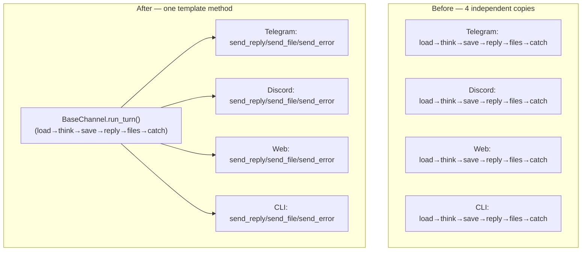

# 🏗️ Architect: Extract shared `run_turn()` template method into `BaseChannel`

**Status:** proposed — no code changes made. For review only.

## One-sentence proposal

Move the "load history → `brain.think()` → save history → reply → send files →
handle errors" sequence — currently hand-copied 10 times across
`channels/{telegram,discord,cli,web}/bot.py` — into a single `run_turn()`
template method on `channels/base.py:BaseChannel`, with each channel supplying
only its own `send_reply` / `send_file` / `send_error` I/O callbacks.

## Why now?

`BaseChannel` already went through exactly this consolidation once, for ACL
logic (`_parse_allowed_users` / `_is_allowed`, commit `e7b302f`). That
refactor stopped at ACL and left the turn-orchestration logic — arguably the
more important piece — duplicated. A grep across `channels/` today shows the
same five-step sequence repeated at 10 call sites:

- `channels/telegram/bot.py`: lines ~250-263 (text), ~340-353 (voice),
  ~400 & ~471-475 (photo/other), ~509 (streaming reply)
- `channels/discord/bot.py`: lines 177-197, 254-262
- `channels/web/bot.py`: lines 126-154, 210-233
- `channels/cli/bot.py`: lines 133-146

Recent commit history (`7c07774`, `85e7526`, `348f4fe`) shows repeated
sync/async dispatch bugs in this exact area, and error-handling has already
started to drift slightly between files (e.g. Telegram's file/voice handlers
reply with `f"⚠️ Something went wrong: {e}"` while others just log and
re-raise or format differently). That's the signature of duplicated logic
with no single point of correction — the thing this proposal fixes.

## Before / after



Proposed addition to `channels/base.py` (illustrative, not implemented):

```python
async def run_turn(
    self,
    *,
    user_id: str,
    user_message: str,
    history_store,          # existing HistoryStore instance (per channel)
    send_reply,              # async (text) -> None
    send_file,                # async (path, caption) -> None
    send_error,                # async (exc) -> None
    on_status=None,
) -> None:
    """Shared think→reply turn. Channels supply only their I/O callbacks."""
    history = history_store.load(user_id)
    try:
        response, updated_history = await self.brain.think(
            user_message=user_message,
            conversation_history=history,
            on_status=on_status,
        )
        history_store.save(user_id, updated_history)
        await send_reply(response)
        for path, caption in self.brain.take_files():
            await send_file(path, caption)
    except Exception as e:
        logger.exception("Error in brain.think()")
        await send_error(e)
```

Each channel keeps its own `send_reply`/`send_file`/`send_error` closures
(they already have the per-message reply target — `update`, discord
`ctx`/`message`, the websocket, or stdout — so no new abstraction is needed
for that part). Call sites shrink from ~12-15 lines each to 5-6 lines that
pass closures into `self.run_turn(...)`.

## Data model changes

None.

## API contract changes

None. This is purely internal to `channels/` — no `/api/*`-equivalent
surface, CLI flags, or message formats change. `Brain.think()`'s signature
and behavior are untouched.

## Migration plan (backward-compatible, incremental)

1. Add `run_turn()` to `BaseChannel` alongside the existing `_parse_allowed_users`/`_is_allowed` helpers — pure addition, no existing method is touched.
2. Migrate **one** channel first (suggest CLI — smallest, only 1 call site, lowest blast radius) to call `run_turn()`, keep the other three untouched.
3. Run the CLI channel manually + existing `tests/` suite; confirm behavior is byte-for-byte identical (same replies, same file sends, same error text).
4. Migrate Telegram (4 call sites), then Discord (2), then Web (2), each as its own commit — every step is independently revertible via `git revert`.
5. Delete the now-dead duplicated try/except blocks per channel as each is migrated. No flag needed: since call sites are swapped one file at a time and behavior is preserved exactly, there is no cutover moment to gate.

## Performance impact

Negligible — this adds one extra async function call frame per turn (closure
dispatch), on the order of microseconds, dwarfed by the LLM round-trip
(hundreds of ms–seconds) that `brain.think()` already performs. No new I/O,
no new allocations beyond the closures themselves.

## Risk level: **low**

- No public/API contract changes.
- No data model or persistence format changes.
- Reversible per-commit, per-channel.
- Worst case if a migration introduces a regression: one channel's replies
  break, caught immediately by manual smoke-testing that channel (Telegram
  bot, Discord bot, web UI, or CLI session) before moving to the next.

## Test strategy

- **Unit:** new `tests/test_base_channel.py` — a fake channel exercises
  `run_turn()` with fake `history_store`/`send_reply`/`send_file`/`send_error`
  callbacks and a stubbed `brain.think()`; assert history is saved, reply is
  sent, files are forwarded in order, and exceptions route to `send_error`
  instead of propagating.
- **Regression:** existing `tests/test_brain.py` / channel-level tests
  continue to pass unmodified since `Brain.think()`'s contract doesn't change.
- **Manual/e2e:** one real round-trip per channel (send a text message, send
  a file, force an error e.g. by disconnecting the provider) before and after
  each channel's migration, per the incremental plan above.

## Who must approve

- Backend/agent lead (owns `brain/` and `channels/` — the two packages this touches)
- Whoever owns the Telegram/Discord/Web channel adapters day-to-day, since they
  carry the migration risk for their channel

## Timeline estimate

2-3 days: ~0.5 day for `BaseChannel.run_turn()` + unit test, ~0.5 day per
channel migration + smoke test (4 channels), with CLI first as the pilot.

## Alternative considered and rejected

Extracting a full `send_reply`/`send_file` **abstract method** pair onto
`BaseChannel` (rather than passing closures into `run_turn()`) was considered
but rejected for this pass: each channel's "reply target" (Telegram `Update`,
Discord `ctx`, the web socket) is scoped per-incoming-event, not per-channel-
instance, so forcing it into `self.send_reply()` would require storing
mutable per-request state on `self` — a bigger, riskier change than this
proposal's scope. Worth revisiting only if a future channel needs it.
