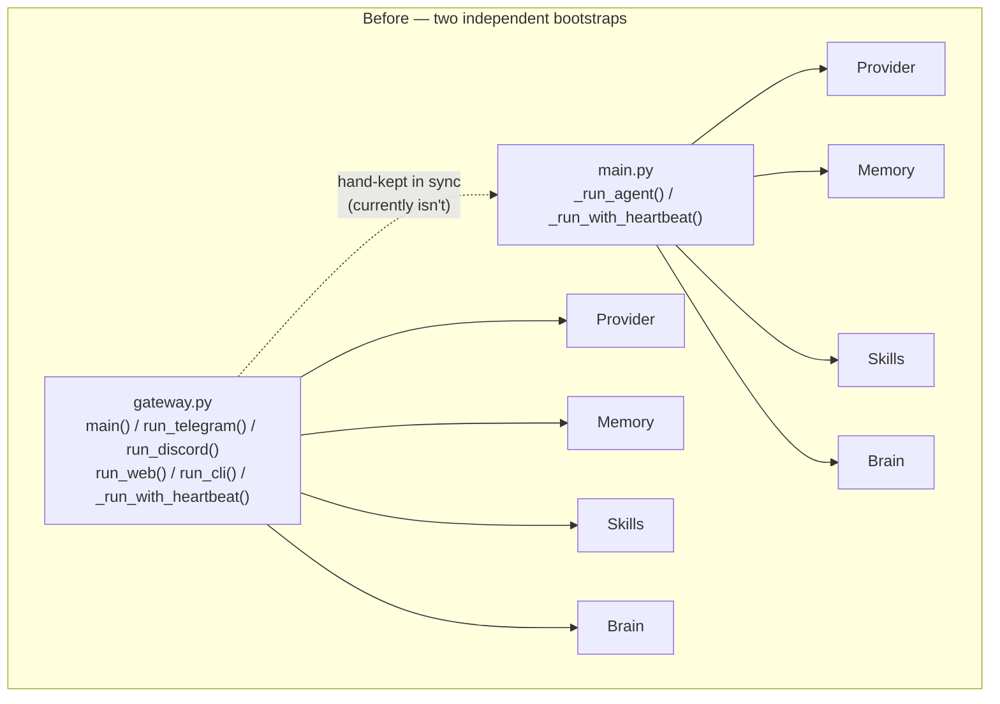
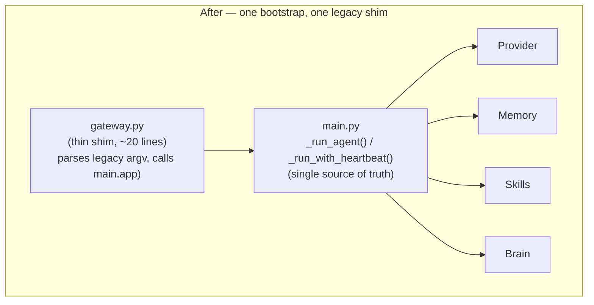

# 2026-07-27 - Retire duplicated bootstrap logic in `gateway.py`

**Status:** proposed (no code changed)
**Risk level:** low
**Who must approve:** repo owner (@cleanunicorn) — solo-maintained project, no separate infra/backend/product leads

## Proposal

Collapse `gateway.py` into a thin backward-compatible shim that delegates to
`main.py`'s `run` command, removing ~150 lines of hand-duplicated
component-wiring logic that currently exists in two places and has already
started to drift.

## Why now?

`CLAUDE.md` and `README.md` both label `gateway.py` as the "Legacy entry
point (still works)," while `main.py` is the documented, `make`-wired entry
point (`make run` → `uv run python main.py run`). Despite that, `gateway.py`
is not a stub — it independently re-implements the entire startup sequence:

- `main()` builds `provider` → `memory` → `skills` → `brain` in the same
  order as `main.py::_run_agent` (`gateway.py:133-155` vs `main.py:598-606`).
- `run_telegram` / `run_discord` / `run_web` / `run_cli` mirror `main.py`'s
  mode dispatch (`gateway.py:90-118` vs `main.py:608-631`).
- `_run_with_heartbeat` is copy-pasted near verbatim
  (`gateway.py:51-87` vs `main.py:634-660`), including the
  `brain.heartbeat = heartbeat` back-reference and signal handling.

This is classic **missing abstraction**: two independent implementations of
"wire up Provider → Memory → Skills → Brain → Channel → Heartbeat" that a
future change (e.g. adding a new required component, changing shutdown
order, adding a new channel) must remember to update in both places. It
already has drifted once — `main.py` gained pre-flight checks, `--watch`
mode, and restart-on-crash handling that `gateway.py` never received — so
the two entry points now behave differently for the same flags. Left alone,
this gap only widens with every future feature added to `main.py`.

`heartbeat/__init__.py` and `skills/self_inspect/tool.py` both reference
`gateway.py` by name in comments/docs, so it's discoverable and someone
could plausibly still run it directly, expecting parity with `main.py`
that no longer exists.

## Before / after

## Tradeoffs

- **Cost:** ~1-2 hours to rewrite `gateway.py` as a shim + update the two
  doc references (`heartbeat/__init__.py`, `skills/self_inspect/tool.py`)
  that describe it as a standalone entry point.
- **Benefit:** removes ~150 lines of duplicated bootstrap logic; every
  future change to startup order, new component, or shutdown behavior is
  made once instead of twice (or made once and silently forgotten in the
  other file, which is the current failure mode).
- **Behavior change:** none for `main.py` users (unaffected). `gateway.py`
  callers keep working — `python gateway.py`, `python gateway.py --cli`,
  `--discord`, `--web` all continue to function, now via `main.py`'s typer
  `app`, so they additionally and harmlessly gain pre-flight checks that
  `gateway.py` never had. If that's judged undesirable for the legacy path,
  the shim can pass `skip_checks=True` to preserve today's silent-start
  behavior exactly.
- **No API/data model impact** — this is a pure Python entry-point change,
  no network contract, no persisted schema, no queue involved.

## Performance impact

Negligible. One extra Python import (`main.app`) and function call per
process start; no measurable difference to startup latency or steady-state
runtime (the actual Provider/Memory/Skills/Brain/Channel objects
constructed are identical either way).

## Migration plan (backward-compatible, reversible)

1. Rewrite `gateway.py::main()` to parse its existing argv shape
   (`--cli` / `--discord` / `--web` / default-telegram) and invoke
   `main.run(...)` (or `main.app(["run", ...])`) instead of duplicating the
   wiring. Keep the `if __name__ == "__main__":` entry point and the
   `_ATLAS_RESTART` re-exec handling so `python gateway.py` keeps working
   unchanged from the outside.
2. Update the two doc comments that describe `gateway.py` as an
   independent bootstrap (`heartbeat/__init__.py:12`,
   `skills/self_inspect/tool.py:92`) to point at `main.py` as the source of
   truth and describe `gateway.py` as a compatibility shim.
3. Update `README.md`/`CLAUDE.md` one line each to say "legacy shim,
   delegates to main.py" instead of "Legacy entry point (still works)" —
   same meaning, accurate implementation detail.
4. No feature flag needed: the change is behind an already-legacy,
   rarely-used entry point, and step 1 preserves the existing external
   interface (same flags, same process behavior for `Ctrl+C`/`SIGTERM`).
   Rollback is a single `git revert` if anything unexpected surfaces.

## Test strategy

- Unit: none of the existing suite imports `gateway.py` today (verified via
  `grep -rn "gateway" tests/` → no hits), so no test currently exercises it;
  add one smoke test that imports `gateway` and asserts `gateway.main` is
  now a thin wrapper (e.g. mocks `main.run` and asserts it's called with
  the right mode) rather than reimplementing the Provider/Memory/Skills/
  Brain construction.
- Manual: run `python gateway.py --cli`, send one message, confirm it
  behaves identically to `uv run python main.py run --cli`.
- Regression check: `make test` must stay green (no existing test touches
  `gateway.py`, so this is a low-risk verification step, not a driver of
  the change).

## Timeline estimate

Half a day including the smoke test and doc updates.
