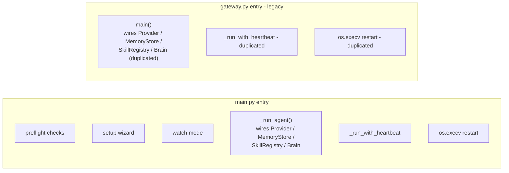
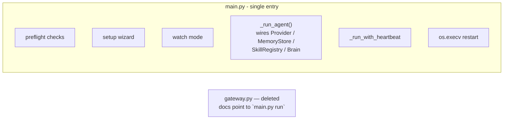

# 🏗️ Architect Proposal: Retire the legacy `gateway.py` entry point

**Status:** Draft — awaiting review
**Proposer:** Architect (automated structural-debt scan)
**Date:** 2026-09-21

> **Note on scope:** This routine's standing brief includes a "Repository-Specific
> Constraints" section written for a FastAPI + worker + MongoDB backend with a
> React/Vite frontend (fastapi-users, `/api/*` contracts, Mongo indexes, Zustand,
> Docker Compose, Redis queues). None of that exists in this repository — Atlas is
> a single-process Python personal agent (CLI/Telegram/Discord/Web channels,
> markdown-file memory, no HTTP API, no database). Those constraints don't apply
> here and appear to be copied from a different project's routine config; this
> proposal is written against Atlas's actual architecture instead, as described in
> `CLAUDE.md`.

## Proposal

Remove `gateway.py`, the "legacy" CLI entry point, and consolidate all
entry-point logic in `main.py`, which already reimplements the same startup
sequence plus features `gateway.py` never received.

## Why now?

`gateway.py` (180 lines) duplicates ~90% of `main.py`'s (664 lines) startup
wiring with **zero code sharing** between them:

| Concern | `main.py` | `gateway.py` |
|---|---|---|
| Provider / MemoryStore / SkillRegistry / Brain wiring | `_run_agent` (main.py:588-631) | `main()` (gateway.py:133-165) |
| Heartbeat loop | `_run_with_heartbeat` (main.py:634-661) | `_run_with_heartbeat` (gateway.py:51-88) |
| Restart-on-update dance (`os.execv`) | main.py:356-359 | gateway.py:174-180 |
| Preflight checks, setup wizard, file-watch mode | ✅ | ❌ (none) |

It's explicitly labeled "Legacy entry point" in three places (`README.md:9`,
`CLAUDE.md:53`, `skills/self_inspect/tool.py:92`), and `channels/cli/bot.py:7`
still tells users to run `python gateway.py --cli` in its own help text.
Verified via grep: **no test, CI workflow, Dockerfile, or systemd unit in this
repo references `gateway.py`** — it's pure unexercised duplication that will
keep silently drifting every time `main.py`'s startup sequence changes (it
already has: preflight checks and watch mode exist only in `main.py`).

## Before / after

**Before** — two independent entry points, wiring duplicated with no shared code:

**After** — single entry point, `gateway.py` removed:

## Data model changes

None.

## API contract changes

None — Atlas has no `/api/*` HTTP contract layer; the "entry point" here is a
CLI/process boundary, not a network API.

## Migration plan (backward-compatible)

1. **Stage 1 (non-breaking shim, <1 day):** Replace `gateway.py`'s body with a
   thin deprecation shim: print a one-line deprecation warning, translate its
   flags (`--cli`, `--discord`, `--web`) to the equivalent `main.py run`
   invocation, and delegate to it. External callers (a user's own cron job,
   systemd unit, or shell alias invoking `python gateway.py` directly) keep
   working unchanged for one release.
2. **Stage 2 (next release, <1 day):** Once the shim has been out for a
   release cycle, delete the duplicated wiring bodies entirely — `gateway.py`
   becomes a ~15-line redirect.
3. **Stage 3 (following release, <1 day):** Delete `gateway.py` outright.
   Update the three "Legacy entry point" references (`README.md:9`,
   `CLAUDE.md:53`, `skills/self_inspect/tool.py:92`) and
   `channels/cli/bot.py:7`'s help text to point at `main.py run --cli`.

Given that nothing in tests/CI/Docker references `gateway.py` today, stages
2–3 could be collapsed into stage 1 if the maintainer is confident no external
script depends on invoking it directly — the shim is the conservative,
reversible option.

## Performance impact

None on any runtime hot path — this only touches process startup. Net effect:
removes ~165 lines of duplicated maintenance surface (gateway.py's wiring
code), i.e. -100% duplication in the entry-point layer.

## Risk level: **low**

`gateway.py` has no test coverage and no CI reference, so this change can't
break automated checks. The only real risk is an external caller (a personal
cron job or systemd unit outside this repo) invoking `python gateway.py`
directly — Stage 1's shim eliminates that risk entirely by keeping the
command working.

## Who must approve

Repo owner (this is a single-maintainer personal project per `README.md`).

## Test strategy

- No new tests required for the deletion itself (gateway.py is untested today).
- Audit `tests/test_channels.py` to confirm it already exercises `main.py`'s
  `_run_agent` path rather than `gateway.py`'s — if it only tests channel
  classes directly, no change needed there.
- Manual smoke test before Stage 3: `uv run python main.py run --cli` for
  each mode (`--discord`, `--web`, default Telegram) to confirm parity with
  what `gateway.py` used to cover.

## Timeline estimate

Stage 1: <1 day. Stage 2: <1 day. Stage 3: <1 day. Total: well under the
1-week budget, can ship in stages independently.
