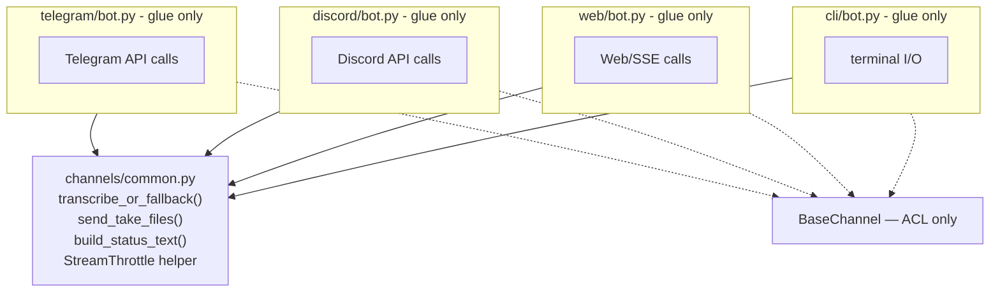

# 🏗️ Architect Proposal: Extract shared channel pipeline into `channels/common.py`

**Status:** Draft — awaiting review
**Proposer:** Architect (automated structural-debt scan)
**Date:** 2026-09-28

> **Note on scope:** This routine's standing brief includes a "Repository-Specific
> Constraints" section written for a FastAPI + worker + MongoDB backend with a
> React/Vite frontend. None of that exists in this repository — Atlas is a
> single-process Python personal agent (CLI/Telegram/Discord/Web channels,
> markdown-file memory, no HTTP API, no database). Those constraints don't
> apply here; this proposal is written against Atlas's actual architecture as
> described in `CLAUDE.md`.

## Proposal

Extract the message-handling pipeline that `channels/telegram/bot.py`,
`channels/discord/bot.py`, `channels/web/bot.py`, and `channels/cli/bot.py`
each reimplement independently — audio transcription + fallback text,
`take_files()` → send-as-photo-or-document, `/status` text assembly, and the
throttled streaming-edit helper — into shared functions in a new
`channels/common.py`, called from each adapter's thin, channel-specific glue
code. `BaseChannel` (`channels/base.py`) today only shares ACL allowlisting;
this adds a second, larger shared surface for pipeline logic without
changing the abstract interface (`start`/`stop`/`push_message`).

This is distinct from the still-open
`2026-09-21-retire-legacy-gateway-entrypoint.md` proposal, which is about
process-entrypoint wiring (`main.py` vs `gateway.py`), not the channel
adapters' per-message runtime logic.

## Why now?

Four adapters reimplement the same conversational pipeline with **zero
shared code beyond ACL checks**, and the duplication has already drifted:

| Concern | Telegram | Discord | Web | CLI |
|---|---|---|---|---|
| Audio transcribe + fallback message | `bot.py:299-335` | `bot.py:217-248` | `bot.py:180-201` | — |
| `take_files()` → send-as-photo/doc loop | 4 call sites: `258,348,400,471` | 2 call sites: `190,260` | 2 call sites: `135,217` | 1 call site: `142` |
| `/status` text (`provider.model_name`, `parse_context_entries()`, `all_skill_names()`) | `bot.py:139-152` | `bot.py:291-301` | — | `bot.py:161-173` |
| Throttled streaming-edit helper | `bot.py:497-507`, interval `_STREAM_EDIT_INTERVAL = 0.6` (`bot.py:38`) | `bot.py:164-174`, interval hardcoded `1.0` | — | — |

Concrete evidence of drift from independent copies, not shared logic:

- **Image-suffix sets differ**: Telegram's `_IMAGE_SUFFIXES` includes `.bmp`
  (`telegram/bot.py:528`); Discord's does not (`discord/bot.py:40`). An
  identical `.bmp` file is sent as a photo on one channel and a raw document
  on the other, for no intentional reason — it's an artifact of copy-paste.
- **Streaming throttle intervals differ** (0.6s vs 1.0s) with no shared
  constant, so tuning one channel's responsiveness doesn't touch the other.
- **Identical fallback string is duplicated verbatim three times**:
  `"Transcription is unavailable — nemo_toolkit may not be installed.]\n"`
  appears character-for-character in `telegram/bot.py:333`,
  `discord/bot.py:246`, `web/bot.py:199` — a wording fix requires three edits.
- **`take_files()` consumption is copy-pasted 9 times** across the four
  files with the same send-as-photo-or-document branching logic reimplemented
  at each site.

Every new attachment type, every wording tweak, every throttle tuning
currently means hunting down and editing 3-4 near-identical blocks instead
of one shared function — a linear cost multiplier that will keep growing as
channels are added or features land.

## Before / after

**Before** — four adapters, each reimplementing the same pipeline pieces independently:

```mermaid
flowchart TB
    subgraph telegram [telegram/bot.py]
        T1[transcribe + fallback]
        T2["take_files() loop x4"]
        T3[/status text]
        T4["streaming throttle (0.6s)"]
    end
    subgraph discord [discord/bot.py]
        D1[transcribe + fallback - duplicated]
        D2["take_files() loop x2 - duplicated"]
        D3[/status text - duplicated]
        D4["streaming throttle (1.0s) - duplicated"]
    end
    subgraph web [web/bot.py]
        W1[transcribe + fallback - duplicated]
        W2["take_files() loop x2 - duplicated"]
    end
    subgraph cli [cli/bot.py]
        C2["take_files() loop x1 - duplicated"]
        C3[/status text - duplicated]
    end
    Base["BaseChannel — ACL only"]
    telegram -.-> Base
    discord -.-> Base
    web -.-> Base
    cli -.-> Base
```

**After** — shared pipeline functions, adapters keep only channel-specific glue:



## Data model changes

None.

## API contract changes

None — Atlas has no `/api/*` HTTP contract layer, and channel adapters are
internal process boundaries, not a public interface. `push_message()` /
`start()` / `stop()` on `BaseChannel` are unchanged.

## Migration plan (backward-compatible, incremental, per-channel)

1. **Stage 1 (<1 day):** Add `channels/common.py` with the four extracted
   functions, unify the two divergent constants (image-suffix set — take the
   union, `.bmp` included; streaming throttle interval — one configurable
   default), and cover them with unit tests using fixture files/mock
   `brain.take_files()` iterators. No adapter is touched yet.
2. **Stage 2 (<2 days, one channel at a time, independently revertable):**
   Migrate Telegram first (most call sites, highest payoff), verify manually
   via `main.py run --cli` and a live Telegram smoke test, then Discord, then
   Web, then CLI. Each channel's migration is an isolated commit that only
   touches that one file plus the shared import — a regression in one
   channel doesn't block or affect the others, and any single stage can be
   reverted independently.
3. **Stage 3 (<1 day):** Once all four adapters call the shared functions,
   delete the now-dead duplicated blocks and confirm no channel still
   defines its own `_IMAGE_SUFFIXES`, fallback string, or throttle interval.

Given the low risk (pure internal refactor, no external contract), stages
could be compressed, but per-channel commits keep each step reviewable and
trivially revertable if a channel-specific edge case is missed during
extraction.

## Performance impact

None on any hot path — this is a pure code-organization change in the
message-handling layer, not a change to LLM calls, transcription, or file
I/O. Net effect: removes ~9 duplicated `take_files()` call sites and 3
duplicated transcription-fallback blocks, consolidating to one implementation
each — roughly -60% duplicated code in the channel layer by line count for
the affected blocks.

## Risk level: **low**

No test or CI currently exercises these code paths directly (per the
existing gateway.py proposal's note, this repo's test coverage is thin), so
the main risk is a behavioral regression introduced during extraction rather
than a broken automated check. Mitigated by: per-channel migration commits
(stage 2), manual smoke-testing each channel after its migration, and the
mechanical nature of the extraction (moving existing logic verbatim into
shared functions, not rewriting it).

## Who must approve

Repo owner (this is a single-maintainer personal project per `README.md`).

## Test strategy

- Unit tests for the four new `channels/common.py` functions in isolation
  (mock `brain.take_files()`, mock `transcribe()`, assorted file extensions
  including `.bmp` to lock in the unified image-suffix behavior).
- Manual smoke test per channel after its stage-2 migration: send a text
  message, an audio message, and trigger a file reply on each of
  Telegram/Discord/Web/CLI; run `/status` on Telegram/Discord/CLI.
- No new integration/e2e harness needed — existing manual verification
  matches how this repo already validates channel behavior.
