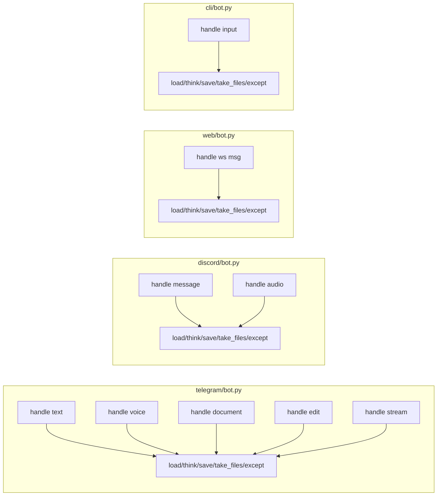
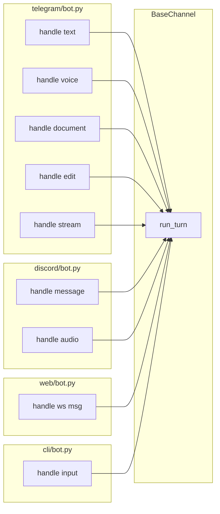

# 🏗️ Architect Proposal: Extract a shared `run_turn()` helper onto `BaseChannel`

**Status:** draft — awaiting review
**Author:** Architect (automated structural-debt scan)
**Date:** 2026-07-20

## Proposal

Extract the repeated "load history → call `brain.think()` → save history →
drain `take_files()` → normalize errors" sequence out of the four channel
adapters (`channels/telegram/bot.py`, `channels/discord/bot.py`,
`channels/web/bot.py`, `channels/cli/bot.py`) into one helper method on
`BaseChannel` (`channels/base.py`), the same class that already centralizes
allowlist logic.

## Why now?

`channels/base.py` was introduced in e7b302f to kill duplicated ACL checks
across channels. The same duplication pattern exists one level up, in the
turn-execution boilerplate around `brain.think()`, and it wasn't swept up in
that pass:

```python
history = self._history.load(user_id)
try:
    response_text, updated_history = await self.brain.think(
        user_message=..., conversation_history=history, ...
    )
    self._history.save(user_id, updated_history)
    for path, caption in self.brain.take_files():
        await self._send_file(..., path, caption)
except Exception as e:
    logger.exception("Error in brain.think()")
    await ...reply(f"⚠️ Something went wrong: {e}")
```

This exact skeleton appears **5 times** in `channels/telegram/bot.py` (text,
document, voice, edited message, streaming reply), **3 times** in
`channels/discord/bot.py`, **2 times** in `channels/web/bot.py`, and once in
`channels/cli/bot.py` — 11 call sites, ~150 lines of near-identical
boilerplate. Every one of the three coroutine/skill-dispatch bugs fixed in
7c07774 / 85e7526 was a symptom of logic like this living in more than one
place; a shared helper gives that class of bug one place to live and one
place to fix, instead of eleven.

It's a direct continuation of an already-approved, already-shipped pattern,
not a new architectural direction.

## Design

### Before



Four copies of the same skeleton, each hand-maintained.

### After



### `BaseChannel.run_turn()` sketch

```python
@dataclass
class TurnResult:
    text: str
    files: list[tuple[Path, str]]

class TurnError(Exception):
    """Raised when brain.think() (or history I/O) fails; .original holds the cause."""
    def __init__(self, original: Exception):
        self.original = original
        super().__init__(str(original))

class BaseChannel(ABC):
    ...
    async def run_turn(
        self,
        user_id: str,
        user_message: str | list,
        on_status: Callable[[str], Awaitable[None]] | None = None,
        system_suffix: str = "",
    ) -> TurnResult:
        """Load history, run brain.think(), persist history, collect files.

        Raises TurnError on failure — callers render the error their own way
        (Telegram reply, Discord placeholder cleanup, web WS frame, etc.);
        this method never touches channel-specific transport.
        """
        history = self._history.load(user_id)
        try:
            response_text, updated_history = await self.brain.think(
                user_message=user_message,
                conversation_history=history,
                on_status=on_status,
                system_suffix=system_suffix,
            )
            self._history.save(user_id, updated_history)
            return TurnResult(text=response_text, files=self.brain.take_files())
        except Exception as e:
            logger.exception("Error in brain.think()")
            raise TurnError(e) from e
```

Channel-specific concerns (typing indicators, placeholder message editing,
Telegram's `reply_markup`, Discord's `placeholder.delete()`, streaming
`on_token`) stay in each `bot.py` — `run_turn()` only owns the part that is
*actually* identical across channels: history lifecycle + `think()` +
`take_files()` + one exception boundary.

### Data model changes
None. `ConversationHistory`, `Message`, and `brain.think()`'s signature are
untouched.

### API contract changes
None — this is internal to the channel layer. Nothing under `channels/*`
exposes an external contract; Telegram/Discord/Web wire formats are
unaffected.

## Migration plan (backward-compatible, incremental)

1. Add `TurnResult` / `TurnError` / `run_turn()` to `channels/base.py`. Purely
   additive — no existing code path changes yet.
2. Migrate **one** call site first (`telegram/bot.py`'s plain-text handler,
   the simplest one) to call `run_turn()` and confirm behavior is identical
   via existing tests + a manual CLI smoke test.
3. Migrate the remaining 10 call sites one PR-sized commit at a time
   (telegram's other 4, then discord's 3, then web's 2, then cli's 1),
   deleting the inlined skeleton at each site as it's replaced.
4. No dual-write phase is needed — each call site's before/after behavior is
   a pure refactor (same `brain.think()` args, same save timing, same
   `take_files()` draining), so it's a straight swap, not a phased rollout.
5. No flag needed: each commit is independently revertable (`git revert`)
   without affecting the others, since call sites don't share mutable state
   beyond what `BaseChannel` already centralizes.

## Performance impact

None expected. This moves code, it doesn't add I/O, locking, or extra
`await` points — `history.load/save` and `brain.think()` are called exactly
as often, in the same order, as today.

## Risk assessment

**Risk: low.**
- No public/API surface touched.
- No data model or persisted-file format changes.
- Reversible per-commit.
- Existing `tests/test_channels.py` already exercises channel message
  handling and will catch behavioral drift; add unit tests for `run_turn()`
  itself (success path, `TurnError` path, files-drained path) alongside the
  migration.

## Test strategy

- Unit test `BaseChannel.run_turn()` directly against a stub `brain`
  (success, exception → `TurnError`, files present/absent) — no channel
  transport needed.
- Keep `tests/test_channels.py`'s existing per-channel tests passing
  unmodified as the regression net for the swap.
- No e2e/integration test needed beyond what already exists — this is an
  internal reshuffle, not a new capability.

## Timeline estimate

Well under a day of focused work: ~1 hour for the helper + tests, ~30 min
per call-site migration × 11 sites ≈ half a day total, split into small,
independently reviewable commits.

## Who must approve

Single-maintainer project — repo owner review only. (The generic
"infra / backend lead / security" reviewer routing in the Architect brief
assumes a team + FastAPI/MongoDB stack; this repo is a solo Python project,
so approval is just the repo owner's call on whether the migration is worth
doing now vs. later.)

## Note on repository mismatch

This proposal was generated by an Architect routine templated for a
FastAPI + MongoDB + React service (see the constraints about `/api/*`
contracts, Mongo indexes, Redis queues, fastapi-users). None of those apply
here — Atlas is a personal Python agent with markdown/JSON file storage and
no HTTP API surface to break. The process (observe → pick one → design →
review → migrate) was followed; the repo-specific constraints were adapted
to what this codebase actually is instead of applied literally.

---

**No code has been changed as part of this proposal** — this document is
the entire diff. Implementation starts only after approval.
