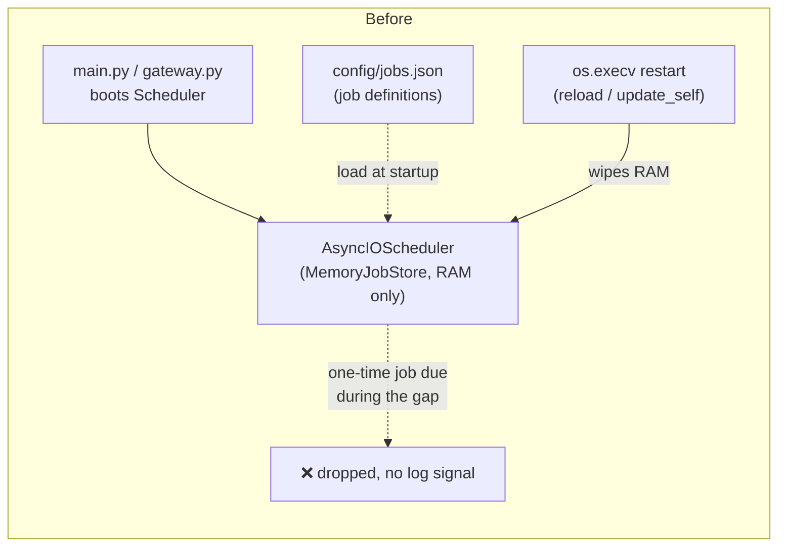
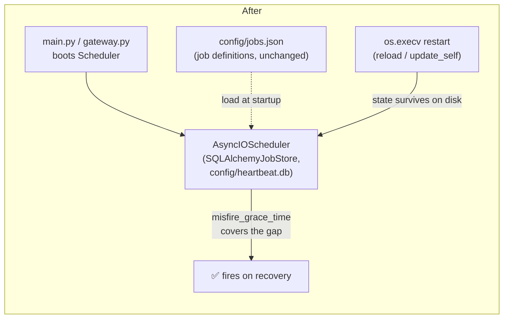

# 🏗️ Architect: Persist heartbeat scheduler state across restarts (SQLAlchemyJobStore)

## Proposal

Swap `heartbeat/scheduler.py`'s `AsyncIOScheduler` from APScheduler's default
in-memory job store to a local SQLite-backed `SQLAlchemyJobStore`
(`~/agent-files/config/heartbeat.db`), and set a `misfire_grace_time` on
registered jobs — so a scheduled job whose fire time falls inside a process
restart window runs on recovery instead of vanishing silently.

## Why now

Atlas has two built-in tools that intentionally kill and re-exec the whole
process: `reload` and `update_self` (`brain/tools.py:275-282`, `:330-410`,
via `os.execv` after a `_RESTART_DELAY = 2.0s`, `brain/tools.py:23`). These
aren't rare ops-only events — the agent itself decides to call them
autonomously (e.g. after installing a skill, or via `update_self` when asked
to self-update).

`Scheduler` currently uses APScheduler's default `MemoryJobStore`
(`heartbeat/scheduler.py:77`, `self._scheduler = AsyncIOScheduler()`), and
`heartbeat/jobs.py` only persists job *definitions* (id/schedule/prompt) to
`config/jobs.json`, never fire/run state. Concretely:

- **One-time jobs are silently dropped if due during a restart.** A job
  scheduled via an ISO-datetime `schedule` (`Scheduler._make_trigger`,
  `heartbeat/scheduler.py:148-171`) whose `run_date` has already passed by
  the time `_load_jobs()` re-registers it after restart will misfire
  immediately with no default `misfire_grace_time` — the reminder/task never
  fires, and there's no log signal a user would notice.
- **No visibility into what was missed.** There's no "last run" or
  "missed" bookkeeping anywhere in `heartbeat/`, so this failure mode is
  invisible until a user notices a scheduled task never ran.

This directly undermines the product's proactive-tasks promise (the
`heartbeat` module exists specifically so Atlas can act without being asked)
and gets *more* likely to bite as `update_self`/`reload` usage grows.

## Before / after





## Data model changes

- New local file: `~/agent-files/config/heartbeat.db` (SQLite, created
  automatically by `SQLAlchemyJobStore` on first run — no migration script
  needed since the in-memory store never persisted anything to migrate
  *from*).
- `heartbeat/jobs.py` / `config/jobs.json` (job **definitions**: id,
  schedule, prompt, enabled) are **unchanged** — they remain the
  user/agent-editable source of truth. Only the *runtime scheduling state*
  (next-fire time, misfire bookkeeping) moves from RAM to disk.
- No changes to the `Job` dataclass or its JSON shape.

## API / contract changes

None. `Scheduler.start/stop/reload_jobs/trigger_job` keep their existing
signatures; this is purely a constructor-level swap of the APScheduler
`jobstores` argument plus a `misfire_grace_time` default on `add_job` calls
in `Scheduler._register`. No channel, skill, or brain-tool contract changes.

## Migration plan (fully backward-compatible)

1. Add `sqlalchemy` to `pyproject.toml` dependencies (required by
   `apscheduler.jobstores.sqlalchemy.SQLAlchemyJobStore`; not currently a
   dependency — confirmed via `uv.lock`/import check). No server, just the
   SQLite dialect bundled with the stdlib `sqlite3` driver.
2. In `Scheduler.__init__` (`heartbeat/scheduler.py:63-77`), construct:
   ```python
   jobstores = {"default": SQLAlchemyJobStore(url=f"sqlite:///{DATA_DIR}/config/heartbeat.db")}
   self._scheduler = AsyncIOScheduler(jobstores=jobstores)
   ```
3. In `Scheduler._register` (`heartbeat/scheduler.py:131-146`), add
   `misfire_grace_time=3600` (1h — tunable) to `add_job(...)` so jobs due
   during a restart window still fire on recovery instead of misfiring
   silently.
4. No changes needed to `_load_jobs`, `reload_jobs`, `trigger_job`,
   `heartbeat/jobs.py`, or `config/jobs.json` — `replace_existing=True`
   already makes re-registration on startup idempotent against whatever the
   job store persisted.
5. **Rollback:** revert the constructor line back to `AsyncIOScheduler()`
   with no `jobstores` arg. One-line, no data migration required either
   direction since `config/jobs.json` (the real source of truth) never
   changes shape.

Staged rollout isn't really necessary here (single-process, no
multi-tenant/shared state), but if we want extra safety: ship behind an
env flag (`HEARTBEAT_PERSISTENT_JOBSTORE=1`, default off) for one release,
flip the default once verified in the maintainer's own instance.

## Performance impact (rough estimate)

- SQLite write on job add/reschedule: low single-digit ms locally, and this
  only happens on job (re)registration — startup, `reload_jobs()`, or after
  each job fires — not on the hot path (`brain.think()` / channel response
  latency is untouched).
- New on-disk file, low KB-to-low-MB range for realistic job counts (this
  is a personal-agent scheduler, not a high-volume queue).
- +1 dependency (`sqlalchemy`, no separate service — just the ORM/core
  package pulling in `sqlite3` from stdlib).

## Risk level: **low**

- No public API/contract surface touched.
- Fully reversible in one line.
- Single-instance daemon design (per `paths.py`, one `agent-files` dir per
  install) — no concurrent-writer risk to the SQLite file.
- Worst case if something goes wrong: same failure mode as today
  (in-memory store), not worse.

## Test strategy

- Unit: instantiate `Scheduler` with the job store pointed at a `tmp_path`
  SQLite file, register a one-time job with `run_date` in the past but
  within `misfire_grace_time`, assert it still fires on `start()`
  (regression test for the exact bug this fixes).
- Integration: start a `Scheduler`, register a job, `stop()` it (simulating
  the pre-`os.execv` shutdown), construct a **new** `Scheduler` instance
  against the same SQLite path, `start()` it, and assert the job's
  `next_run_time` survived across the two instances.
- Regression: existing `tests/test_heartbeat.py` suite (job CRUD,
  `reload_jobs`, `trigger_job`) should pass unmodified — the job-store swap
  is transparent to that surface.

## Who must approve

Repo owner (@cleanunicorn) — this is a solo-maintainer project with no
separate infra/backend-lead/product roles; flagging here since the
`sqlalchemy` dependency addition and `config/heartbeat.db` file are the two
concrete things worth a conscious sign-off before implementation starts.

---

No code has been changed as part of this proposal. Filing as a draft PR per
process — implementation only begins after this is approved.
