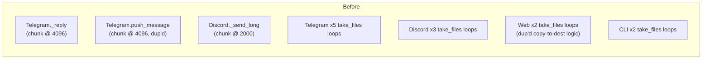
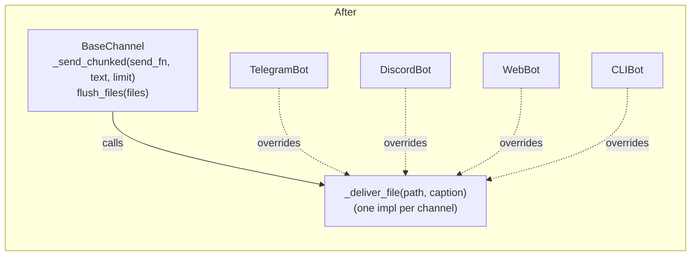

# 🏗️ Architect Proposal: Consolidate response-delivery duplication into `BaseChannel`

**Status:** Draft — awaiting approval
**Risk:** Low
**Approver:** Repo owner (this is a solo-maintained project; no separate infra/backend/security leads exist to tag)

> Note on scope: this session's Architect prompt ships with generic
> "Repository-Specific Constraints" for a FastAPI + MongoDB + React stack.
> Atlas is a Python agent with Telegram/Discord/Web/CLI channel adapters —
> no FastAPI backend contract, no MongoDB, no React frontend. Those
> constraints don't apply here, so this proposal is grounded in the actual
> architecture described in `CLAUDE.md` instead.

## Proposal

Move two pieces of logic that are currently copy-pasted into every channel
adapter — **long-message chunking** and **draining `brain.take_files()`
after a turn** — onto the `BaseChannel` ABC (`channels/base.py`) as shared
template methods, with each channel implementing only the transport-specific
primitive (`_deliver_file`, and a `send_fn` callback for chunking).

`BaseChannel` already exists for exactly this purpose — it was introduced in
`e7b302f` ("refactor: introduce BaseChannel ABC to eliminate channel ACL
duplication") to dedupe allowlist parsing. This proposal is the natural next
step down that same path for the two duplications that are left.

## Why now?

Grepping the four channel adapters shows the same two patterns re-implemented
independently in each file:

**1. Chunking a reply to a platform's message-length limit**, duplicated
*within the same file* in Telegram, not shared with Discord at all:
- `channels/telegram/bot.py:117-131` (`_reply`) — splits at 4096 chars
- `channels/telegram/bot.py:568-570` (`push_message`) — splits at 4096 chars again, independently
- `channels/discord/bot.py:345-348` (`_send_long`) — splits at 2000 chars, as a free module function only Discord can call

**2. Draining `brain.take_files()` and delivering each file**, reimplemented
at every call site instead of once per channel:
- Telegram: 5 call sites (`bot.py:258,348,400,471,573`), each looping and calling the shared `_send_file` helper — the helper is reused, but the loop+existence-check is pasted 5 times
- Discord: 3 call sites (`bot.py:190,260,321`), same pattern
- Web: **2 near-identical inline implementations of the same copy-to-`_FILES_DIR` logic within one file** (`bot.py:135-141` and `bot.py:217-223`) — this one is duplication with no reuse at all today
- CLI: 2 call sites (`bot.py:142,178`)

None of this is a bug today, but it's the shape of debt that turns into a bug
the next time someone adds a fifth channel or changes the take_files()
contract (e.g. to support directories or streamed uploads) — that change
would need to land in ~12 places instead of 4.

## Design





`BaseChannel` gains two concrete methods and one abstract hook:

```python
# channels/base.py
async def _send_chunked(self, send_fn, text: str, limit: int) -> None:
    """Split text into <=limit-char pieces and send each via send_fn, in order."""
    for i in range(0, max(1, len(text)), limit):
        await send_fn(text[i : i + limit])

async def flush_files(self, files: list[tuple[Path, str]]) -> None:
    """Drain a take_files()-style list, delivering each via _deliver_file."""
    for path, caption in files:
        path = Path(path)
        if path.exists():
            await self._deliver_file(path, caption)

@abstractmethod
async def _deliver_file(self, path: Path, caption: str) -> None: ...
```

Each channel keeps its transport-specific send code (Telegram's photo-vs-document
branching, Discord's `discord.File`, Web's copy-into-`_FILES_DIR` + WS message,
CLI's `print`) but implements it **once**, as `_deliver_file`. Call sites
collapse from ~12 inline loops to `await self.flush_files(self.brain.take_files())`
and `await self._send_chunked(update.message.reply_text, html_text, 4096)`.

No public API, `/api/*`-equivalent contract, or message-protocol change —
this is internal to the channel adapters. The `push_message` and `start`/`stop`
signatures on `BaseChannel` are untouched.

## Migration plan (backward-compatible, staged)

1. **Add** `_send_chunked` and `flush_files` + abstract `_deliver_file` to
   `BaseChannel`. Purely additive — no existing channel is touched, nothing
   breaks.
2. **Migrate Telegram** (highest duplication: 2 chunking sites + 5 take_files
   sites). Implement `_deliver_file` from the existing `_send_file` body;
   replace both chunking loops and all 5 take_files loops with the shared
   calls. Run `tests/test_channels.py` + manual smoke test (send a long
   reply, send a photo, use the calendar skill to trigger a file).
3. **Migrate Discord.** Delete the module-level `_send_long`/`_send_file`
   free functions; move their bodies into `_deliver_file` and use
   `_send_chunked`.
4. **Migrate Web.** This is the one with real (not just theoretical)
   duplication — the two copy-to-`_FILES_DIR` blocks collapse into one
   `_deliver_file`.
5. **Migrate CLI** (smallest, lowest risk — just print statements).
6. Delete dead code as each stage lands. Each stage is an independent,
   revertible commit; a bad migration on one channel doesn't block or affect
   the others since `_deliver_file` is per-subclass.

## Performance impact

None expected — this is a pure refactor of existing loops into a shared
helper, same number of I/O calls, same chunk sizes, no new allocations of
consequence. Not worth a benchmark; correctness (identical output) is what
matters here, covered by the test strategy below.

## Test strategy

- **New:** `tests/test_base_channel.py` — unit tests for `_send_chunked`
  (boundary cases: empty string, exact multiple of `limit`, one-over-limit)
  and `flush_files` (missing path is skipped, delivery order preserved).
- **Regression:** existing `tests/test_channels.py` (373 lines, already
  covers Telegram reply-context building, Discord allowlist parsing, Web UI
  serving) must stay green through every migration stage — it's the
  safety net proving observable behavior didn't change per channel.
- **Manual smoke test per stage:** since 3 of the 4 channels talk to real
  external platforms (Telegram/Discord APIs, a browser WebSocket), automated
  coverage won't catch a transport-level regression (e.g. wrong `parse_mode`)
  — each migration stage should be smoke-tested against the real platform
  before merging, not just unit-tested.

## Lesson / rationale for scoping it this way

This stays to *one* structural change (response delivery) rather than also
touching, say, the tool-selection duplication in `brain/engine.py` or the
large `skills/google_calendar/tool.py` (939 lines) — those are real but
separate concerns with their own tradeoffs, and bundling them would violate
the "propose one change" constraint this process is built around.
