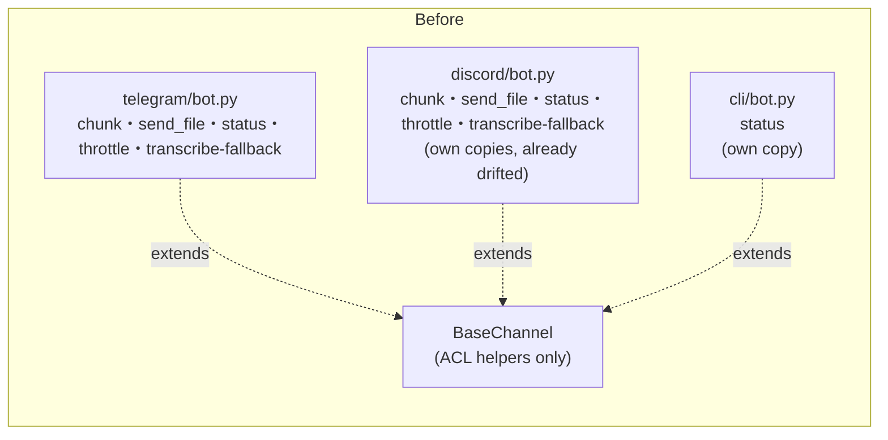
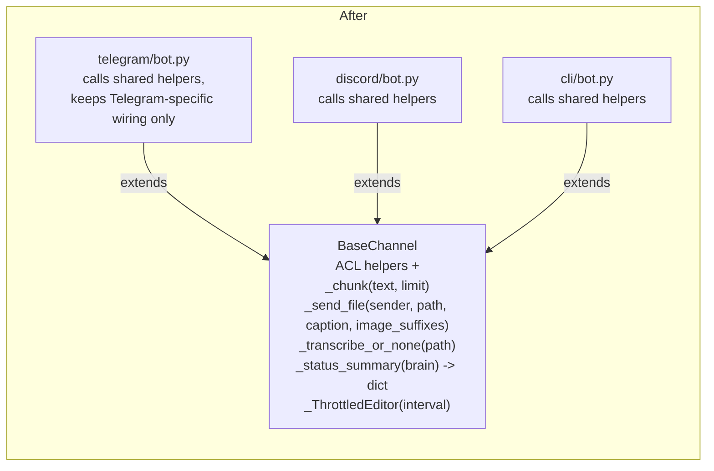

# Architect Proposal: Extend `BaseChannel` with shared I/O helpers

**Status:** Draft — awaiting review
**Risk level:** Low
**Approvers:** repo owner / whoever reviews channel-layer PRs

## One-sentence proposal

Move the message-chunking, file-sending, transcription-fallback, and
`/status` string-building logic that is currently copy-pasted across
`channels/telegram/bot.py`, `channels/discord/bot.py`, and
`channels/cli/bot.py` into shared helpers on `channels/base.py::BaseChannel`,
the same class that already absorbed the ACL-check duplication in #19
(commit `e7b302f`).

## Why now?

Commit `e7b302f` ("introduce BaseChannel ABC to eliminate channel ACL
duplication") established `BaseChannel` as the right home for cross-channel
logic and proved the pattern works. But it only tackled the allowlist
check. Four other behaviors are still hand-duplicated per channel, with the
duplicates already drifting:

| Behavior | Telegram | Discord | CLI |
|---|---|---|---|
| Long-message chunking | `telegram/bot.py:120-127,568-570` (4096 chars, HTML-aware) | `discord/bot.py:345-348` (`_send_long`, 2000 chars) | n/a (stdout) |
| Image vs. document send | `telegram/bot.py:528,539,578` — own `_IMAGE_SUFFIXES = {.png,.jpg,.jpeg,.gif,.webp,.bmp}` | `discord/bot.py:40,351-364` — separately-defined `_IMAGE_SUFFIXES = {.png,.jpg,.jpeg,.gif,.webp}` (missing `.bmp` — already inconsistent) | n/a |
| Voice transcription fallback (`RuntimeError` = unavailable vs. generic `Exception` = failed, same log/skip shape) | `telegram/bot.py:314-323` | `discord/bot.py:230-237` | n/a |
| `/status` summary (model, skills, memory count, tokens) | `telegram/bot.py:133-152` | `discord/bot.py:283-301` | `cli/bot.py:158-173` |
| Streaming "thinking…" throttle-then-edit | `telegram/bot.py:38,480-526` (`_STREAM_EDIT_INTERVAL = 0.6`) | `discord/bot.py:161-174` (hardcoded `1.0`) | n/a |

None of this is a bug today, but it is the same shape of problem the ACL
refactor fixed: every new channel (a future Slack or Matrix adapter, work
already anticipated by `channels/web/bot.py` existing) means re-deriving
these five behaviors a fourth time, and the `_IMAGE_SUFFIXES` mismatch
above shows the copies already silently diverge.

## Tradeoffs

- **Cost:** ~1 day of focused refactor + review. Touches 3 files
  (`telegram/bot.py`, `discord/bot.py`, `cli/bot.py`) plus `base.py`. No
  behavior is intended to change, so the diff is mechanical (extract →
  call shared helper → delete local copy), file by file.
- **Benefit:** Removes ~120 duplicated lines across the three bots
  (measured from the ranges above), fixes the existing `_IMAGE_SUFFIXES`
  drift, and gives the next channel adapter (Slack/Matrix/etc.) five
  behaviors "for free" instead of five more copies to hand-write and
  eventually let drift.
- **Performance impact:** None — these are the same code paths, just
  relocated. No new I/O, no new allocations of consequence (a `TypedDict`/
  dataclass for status fields is negligible).
- **Risk:** Low. Each behavior can be extracted and swapped in one channel
  at a time behind the existing call sites, so a bad extraction is caught
  by that channel's own tests/manual smoke test before touching the next
  channel — no shared feature flag needed because each channel keeps
  working independently throughout the migration (see below).

## Before / after

## Data model / API contract changes

None. This is internal to `channels/`; no `/api/*`-style external contract,
no persisted schema, and no change to bot-visible behavior (message text,
chunk boundaries per-platform limit, and status fields stay identical —
only where the code lives changes).

## Migration plan

Backward-compatible at every step; no dual-write or feature flag needed
since each channel is swapped independently and the old per-channel
methods keep working until their call site is deleted in the same commit
that adds the shared helper's usage:

1. Add `_chunk_text(text: str, limit: int) -> list[str]` and
   `_send_file(self, sender, path, caption, image_suffixes)` to
   `BaseChannel`, generalizing today's `telegram/bot.py:_send_file` (widen
   `image_suffixes` to a class-level default `BaseChannel._IMAGE_SUFFIXES`
   that includes `.bmp`, fixing the Discord drift).
2. Add `_transcribe_or_none(self, path) -> str | None` wrapping the
   `transcribe()` call + the `RuntimeError`/`Exception` split already
   common to Telegram, Discord, and Web (`channels/web/bot.py:162-207`).
3. Add `_status_summary(self, brain) -> dict` returning the fields already
   assembled ad hoc in each `/status` handler; each channel formats the
   dict into its own message style (Telegram HTML, Discord embed, CLI
   plain text) — only the data assembly is shared, not the rendering.
4. Add a small `_ThrottledEditor` helper (interval, last-edit timestamp,
   edit callback) replacing the hand-rolled throttle loops.
5. Migrate one channel at a time (suggested order: CLI — smallest surface
   — then Telegram, then Discord), deleting the local copy in the same PR
   that switches it to the shared helper, running that channel's test
   file and a manual smoke test before moving to the next.
6. No rollback plan beyond `git revert` is needed — each step is a small,
   independent, reviewable commit.

## Test strategy

- Unit tests for the new `BaseChannel` helpers in isolation (chunk
  boundaries at exactly the limit, off-by-one; image vs. non-image
  suffix routing; throttle firing/not-firing across a fake clock).
- Re-run existing `tests/test_channels.py` and `tests/test_formatting.py`
  after each per-channel migration step — behavior must stay identical.
- Manual smoke test per channel after its migration: send a long message,
  send an image and a non-image file, trigger `/status`, and (Telegram/
  Discord only) send a voice note, before deleting that channel's old code.

## Timeline estimate

~1 day: half a day to add and unit-test the `BaseChannel` helpers, half a
day to migrate the three channels one at a time and re-run their tests.

## Lesson / pattern note

This is a direct continuation of the pattern from #19 — worth watching
whether *this* refactor also turns out to be partial (i.e. whether a
future channel adapter surfaces a sixth duplicated behavior we didn't
catch here). If so, that recurrence itself would be worth a journal entry.
