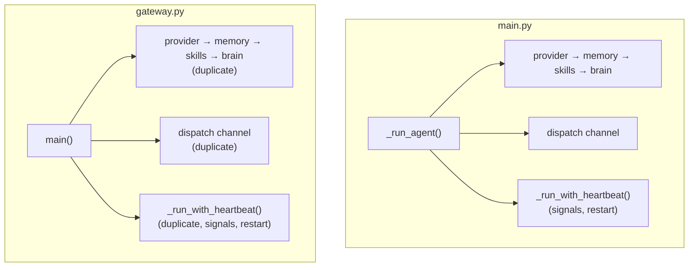
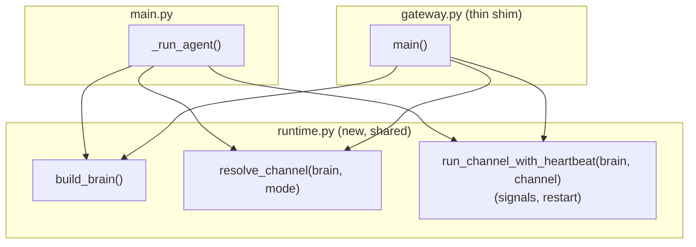

# 🏗️ Architect Proposal: Unify agent bootstrap between `main.py` and `gateway.py`

**Status:** Proposed — no code changed. Awaiting approval.

## Problem

`gateway.py` ("Legacy entry point (still works)" per `README.md`) and
`main.py`'s `run` command each independently:

1. Set up logging
2. Construct the provider → memory → skills → brain chain
   (`get_provider()`, `MemoryStore()`, `SkillRegistry()`, `Brain(...)`)
3. Dispatch to a channel (`cli` / `telegram` / `discord` / `web`)
4. Wire up `Heartbeat`, start/stop it alongside the channel
5. Install `SIGINT`/`SIGTERM` handlers around an `asyncio.Event`
6. Support the same `_ATLAS_RESTART` env-var + `os.execv` restart trick

Side by side:

| | `gateway.py` | `main.py` |
|---|---|---|
| Bootstrap | `main()` (L121–165) | `_run_agent()` (L588–631) |
| Heartbeat + shutdown | `_run_with_heartbeat()` (L51–87) | `_run_with_heartbeat()` (L634–660) |
| Restart-on-SIGTERM | L174–180 | L356–359 |

The two copies have already drifted once (`main.py`'s version uses
`console.print` + `BaseChannel` typing; `gateway.py`'s uses bare
`logger.info`), and neither is covered by `tests/` — a grep for
`gateway|_run_agent|_run_with_heartbeat` across `tests/` returns nothing.
Every future change to bootstrap order, a new channel, or shutdown
behavior has to be remembered and applied twice, and there's no test to
catch a missed edit.

This matches the CLAUDE.md description of `gateway.py` as legacy: the
duplication exists only to keep `python gateway.py` invocations working,
not because the two entry points need to diverge in behavior.

## Proposal

Extract the shared bootstrap into one module, `runtime.py`, and make both
entry points call into it. `gateway.py` keeps its exact current CLI
surface (`--cli` / `--discord` / `--web`, default Telegram) as a thin
shim, so anything invoking `python gateway.py` directly (a systemd unit,
a cron entry, a Docker `CMD`) keeps working unchanged.

### Before

### After

## Data model / API contract changes

None. This is internal wiring only — no change to `/config/.env` keys,
skill contracts, provider interfaces, or CLI flags on either entry point.

## Migration plan (backward-compatible, staged)

1. Add `runtime.py` with `build_brain()` (logging setup + provider/memory/
   skills/brain construction), `resolve_channel(brain, mode)` (returns the
   instantiated channel, or `None` for `cli`), and
   `run_channel_with_heartbeat(brain, channel)` (heartbeat lifecycle,
   signal handlers, restart-on-`_ATLAS_RESTART`).
2. Update `main.py::_run_agent` to call the three `runtime.py` functions;
   delete its now-redundant local `_run_with_heartbeat`.
3. Update `gateway.py::main()` to do the same; delete its local
   `run_cli` / `run_telegram` / `run_discord` / `run_web` /
   `_run_with_heartbeat`, keeping its `argparse` surface identical.
4. Add `tests/test_runtime.py`: mock `get_provider` / `MemoryStore` /
   `SkillRegistry`, assert `build_brain()` wires them into `Brain`
   correctly; assert `resolve_channel()` picks the right channel class
   per mode.
5. Smoke-test both entry points manually (`uv run python gateway.py --cli`
   and `uv run python main.py run --cli --skip-checks`) to confirm
   identical behavior, then run `make test` and `ruff check`.
6. Fast-follow (separate, later proposal — not part of this change):
   once confirmed nothing external depends on `python gateway.py`
   directly, delete the file and point README at `main.py` only.

Each stage is independently revertible; nothing touches persisted state
or external contracts, so there's no dual-write or data-migration
concern.

## Performance impact

Negligible. Pure code motion — one extra module import at process start
(sub-millisecond); no change to the request/response hot path (bootstrap
runs once per process lifetime, not per message).

## Risk: **low**

- No public API, config, or CLI flag changes.
- `gateway.py`'s external surface is preserved exactly.
- Currently zero test coverage on either duplicated copy, so this is a
  net increase in safety, not a decrease.
- Fully reversible (revert the two edits + new file).

## Test strategy

- Unit: new `tests/test_runtime.py` covering `build_brain()` and
  `resolve_channel()`.
- Regression: full `make test` + `ruff check` (no behavior change
  expected elsewhere).
- Manual smoke: both `gateway.py` and `main.py run` in `--cli` mode.

## Timeline estimate

Half a day: ~1–2h extraction, ~1h tests, ~1h manual smoke-test across
the four channel modes.

## Who must approve

Single-maintainer project — repo owner (`cleanunicorn`) sign-off before
implementation. No separate infra/security review needed; nothing here
touches auth, data storage, or external-facing contracts.
